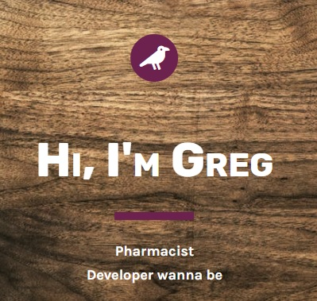

<p align="center">
<a href="https://grzegorz-jodlowski.github.io/sample-portfolio/"></a>
</p>


# <p align="center">🚀 Sample Portfolio</p>
<p align="center">Simple project to learn basic HTML and CSS.</p>

</br>

## Table of Contents

- [What's this project about?](#about)
- [Technologies used](#technologies)
- [What I learned?](#what)
- [Interesting code snippet](#interesting)
- [GitHub Pages](#gitHub)

</br>

## <a name="about"></a>What's this project about?

This is one-page portfolio written to get skills in web development.
It contains a few section with gallery and contact form.

</br>

## <a name="technologies"></a>Technologies used
- HTML
- CSS
- SCSS

</br>

## <a name="what"></a>What I learned?
- write a simple website structure,
- use complex CSS selectors,
- write HTML code in semantic way,
- organise .html and .css files,
- build contact form,
- attach images in proper way,
- create simple hover effects,
- set elements on the page in correct way,
- read documentation (ex. <a href="https://cssreference.io/">CSS Reference</a>),
- validate HTML or CSS code (ex. <a href="https://validator.w3.org/">HTML Validator</a>)
- pick correct colour pallete to website (ex. <a href="https://flatuicolors.com/">Flat UI Colors</a>)
- use google fonts (<a href="https://fonts.google.com">Google font</a>)
- find free photos (ex. <a href="https://www.pexels.com/">Pexels</a>)
- check browser support (ex. <a href="https://caniuse.com/">Can I use...</a>)
- use free icons (ex. <a href="https://fontawesome.com/icons?d=gallery">Font awesome</a>)


</br>

## <a name="interesting"></a>Interesting code snippet (for me of course 😉)
- center child

```css
.splash-inner {
    position: absolute;
    top: 50%;
    left: 50%;
    transform: translate(-50%, -50%);
}
```
- adjust photo display

```css
.gallery-item img {
    width: 100%;
    height: 100%;
    object-fit: cover;
}
```

</br>

## <a name="gitHub"></a>GitHub Pages
<a href="https://grzegorz-jodlowski.github.io/sample-portfolio/">Sample portfolio</a>